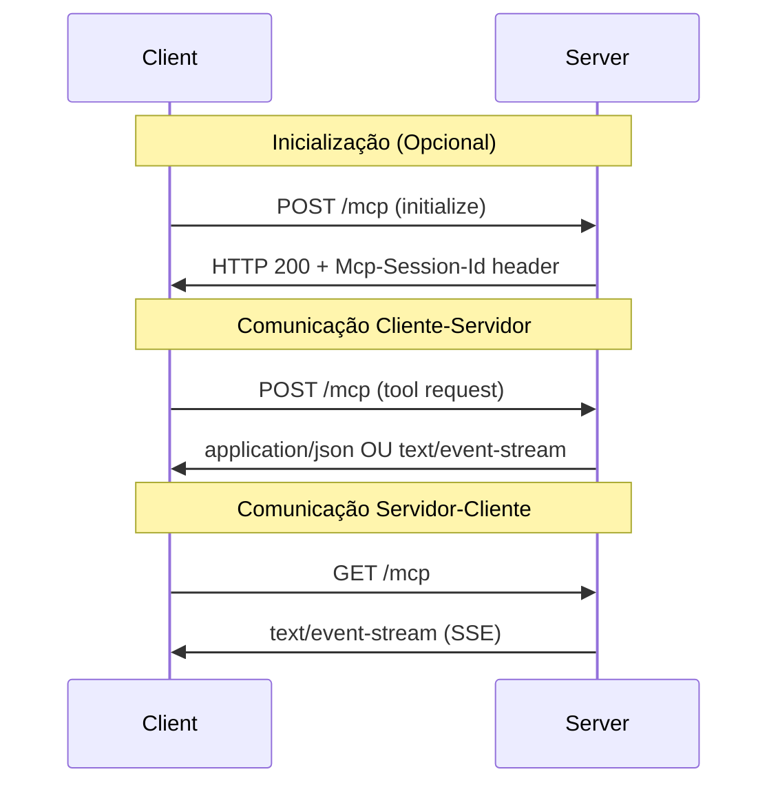

# Plano de Ação: Migração do Servidor MCP de STDIO para Streamable HTTP

## Índice
1. [Introdução](#introdução)
2. [Análise da Implementação Atual](#análise-da-implementação-atual)
3. [O que é Streamable HTTP](#o-que-é-streamable-http)
4. [Arquitetura e Funcionamento](#arquitetura-e-funcionamento)
5. [Vantagens da Migração](#vantagens-da-migração)
6. [Plano de Implementação](#plano-de-implementação)
7. [Configuração e Deploy](#configuração-e-deploy)
8. [Considerações sobre Resumabilidade](#considerações-sobre-resumabilidade)
9. [Segurança e Boas Práticas](#segurança-e-boas-práticas)
10. [Exemplos de Código](#exemplos-de-código)
11. [Testes e Validação](#testes-e-validação)
12. [Migração Gradual](#migração-gradual)

## Introdução

Este documento apresenta um plano de ação detalhado para migrar o servidor MCP "Prompts Generator for Devs" do transporte **STDIO** para **Streamable HTTP**. A migração visa melhorar a escalabilidade, permitir múltiplas conexões simultâneas e facilitar o deploy em ambientes de produção.

### Contexto Atual
- **Servidor atual**: TypeScript com transporte STDIO
- **Funcionalidades**: Geração de prompts otimizados para desenvolvedores
- **Transporte atual**: StdioServerTransport
- **Deploy**: Docker com execução local

## Análise da Implementação Atual

### Estrutura Atual
```typescript
// src/mcp.ts - Implementação atual
import { McpServer } from "@modelcontextprotocol/sdk/server/mcp.js";
import { StdioServerTransport } from "@modelcontextprotocol/sdk/server/stdio.js";

const server = new McpServer({
  name: "MCP Server Prompts Generator for Devs",
  version: "0.1.0"
});

const transport = new StdioServerTransport();
await server.connect(transport);
```

### Limitações Identificadas
- **Conexão única**: STDIO suporta apenas um cliente por vez
- **Deploy local**: Requer execução como subprocesso
- **Escalabilidade limitada**: Não suporta múltiplas conexões simultâneas
- **Infraestrutura complexa**: Necessita de configuração específica por cliente

## O que é Streamable HTTP

### Definição
Streamable HTTP é o novo mecanismo de transporte do MCP (versão 2025-03-26) que substitui o HTTP+SSE, oferecendo comunicação baseada em HTTP com suporte opcional a Server-Sent Events (SSE).

### Características Principais
- **Endpoint único**: Todas as comunicações através de um único endpoint HTTP (ex: `/mcp`)
- **Métodos suportados**: POST, GET, DELETE, OPTIONS
- **Flexibilidade de resposta**: JSON simples ou streaming via SSE
- **Gerenciamento de sessão**: Suporte opcional a sessões stateful
- **Resumabilidade**: Capacidade de reconectar e retomar streams

## Arquitetura e Funcionamento

### Fluxo de Comunicação



### Tipos de Resposta

1. **Resposta JSON Simples**
   ```http
   Content-Type: application/json
   {"jsonrpc": "2.0", "id": "1", "result": {...}}
   ```

2. **Streaming SSE**
   ```http
   Content-Type: text/event-stream
   data: {"jsonrpc": "2.0", "id": "1", "result": {...}}
   ```

### Gerenciamento de Sessão

Para servidores **stateful**:
- Session ID gerado na inicialização
- Header `Mcp-Session-Id` em todas as requisições subsequentes
- Possibilidade de terminar sessão via DELETE

Para servidores **stateless** (recomendado para este projeto):
- Não há session ID
- Cada requisição é independente
- Melhor escalabilidade

## Vantagens da Migração

### Escalabilidade
- **Múltiplas conexões simultâneas**
- **Deploy em servidores web tradicionais**
- **Compatibilidade com load balancers**
- **Suporte a ambientes serverless**

### Flexibilidade de Deploy
- **Containers web padrão**
- **Integração com API Gateways**
- **CDN e proxy reverso**
- **Deploy em cloud providers**

### Melhor Experiência do Usuário
- **Acesso via URL HTTP**
- **Não requer configuração de subprocesso**
- **Suporte a clientes web**
- **Melhor debugging e monitoramento**

### Infraestrutura
- **Logs centralizados**
- **Métricas HTTP padrão**
- **Rate limiting nativo**
- **CORS e autenticação HTTP**

## Plano de Implementação

### Fase 1: Preparação (Estimativa: 2-3 dias)

#### 1.1 Atualização de Dependências
```bash
npm install express @types/express
npm install @modelcontextprotocol/sdk@latest
```

#### 1.2 Estrutura de Arquivos
```
src/
├── server-http.ts          # Nova implementação HTTP
├── server-stdio.ts         # Implementação STDIO atual (renomeada)
├── transports/
│   ├── http-transport.ts   # Configuração do transporte HTTP
│   └── stdio-transport.ts  # Configuração do transporte STDIO
├── tools/
│   └── prompt_tool.ts      # Sem alterações
└── shared/
    └── server-config.ts    # Configurações compartilhadas
```

### Fase 2: Implementação Core (Estimativa: 3-4 dias)

#### 2.1 Implementação do Servidor HTTP Base
```typescript
// src/server-http.ts
import express from 'express';
import { McpServer } from "@modelcontextprotocol/sdk/server/mcp.js";
import { StreamableHTTPServerTransport } from "@modelcontextprotocol/sdk/server/streamableHttp.js";

const app = express();
app.use(express.json());

const server = new McpServer({
  name: "MCP Server Prompts Generator for Devs",
  version: "0.1.2",
  description: "MCP server specialized in generating optimized prompts for developers"
});

// Configuração stateless (sem gerenciamento de sessão)
const transport = new StreamableHTTPServerTransport({
  sessionIdGenerator: undefined // stateless
});
```

#### 2.2 Configuração de Rotas
```typescript
// Endpoint principal MCP
app.post('/mcp', async (req, res) => {
  try {
    await transport.handleRequest(req, res, req.body);
  } catch (error) {
    console.error('Error handling MCP request:', error);
    if (!res.headersSent) {
      res.status(500).json({
        jsonrpc: '2.0',
        error: { code: -32603, message: 'Internal server error' },
        id: null,
      });
    }
  }
});

// GET para estabelecer streams SSE (opcional)
app.get('/mcp', async (req, res) => {
  res.status(405).json({
    jsonrpc: "2.0",
    error: { code: -32000, message: "Method not allowed" },
    id: null
  });
});

// Health check
app.get('/health', (req, res) => {
  res.json({ status: 'ok', timestamp: new Date().toISOString() });
});
```

### Fase 3: Configuração e Segurança (Estimativa: 2-3 dias)

#### 3.1 Configurações de Segurança
```typescript
// CORS Configuration
app.use((req, res, next) => {
  res.header('Access-Control-Allow-Origin', process.env.ALLOWED_ORIGINS || '*');
  res.header('Access-Control-Allow-Methods', 'GET, POST, DELETE, OPTIONS');
  res.header('Access-Control-Allow-Headers', 'Content-Type, Accept, Authorization');
  next();
});

// Validação de Origin Header (segurança DNS rebinding)
app.use((req, res, next) => {
  const origin = req.get('Origin');
  if (origin && !isAllowedOrigin(origin)) {
    return res.status(403).json({
      error: 'Forbidden origin'
    });
  }
  next();
});

// Rate limiting
import rateLimit from 'express-rate-limit';
const limiter = rateLimit({
  windowMs: 15 * 60 * 1000, // 15 minutos
  max: 100 // máximo 100 requests por window
});
app.use('/mcp', limiter);
```

#### 3.2 Configuração de Ambiente
```typescript
// src/config/environment.ts
export const config = {
  port: process.env.PORT || 3000,
  host: process.env.HOST || '127.0.0.1',
  allowedOrigins: process.env.ALLOWED_ORIGINS?.split(',') || ['*'],
  enableCors: process.env.ENABLE_CORS === 'true',
  logLevel: process.env.LOG_LEVEL || 'info'
};
```

### Fase 4: Docker e Deploy (Estimativa: 2 dias)

#### 4.1 Atualização do Dockerfile
```dockerfile
FROM node:18-alpine

WORKDIR /app

# Copy package files
COPY package*.json ./
RUN npm ci --only=production

# Copy source and build
COPY src/ ./src/
COPY tsconfig.json ./
RUN npm run build

# Expose port
EXPOSE 3000

# Start command
CMD ["node", "dist/server-http.js"]
```

#### 4.2 Docker Compose para Desenvolvimento
```yaml
# docker-compose.dev.yml
version: '3.8'
services:
  mcp-server:
    build: .
    ports:
      - "3000:3000"
    environment:
      - NODE_ENV=development
      - PORT=3000
      - HOST=0.0.0.0
      - ENABLE_CORS=true
    volumes:
      - ./prompts:/app/prompts
```

## Configuração e Deploy

### Configuração para Clientes

#### Claude Desktop (via URL)
```json
{
  "mcpServers": {
    "mcp-prompts-for-devs-http": {
      "type": "streamable-http",
      "url": "http://localhost:3000/mcp"
    }
  }
}
```

#### Cursor IDE
```json
{
  "mcp.servers": {
    "mcp-prompts-for-devs-http": {
      "type": "streamable-http",
      "url": "http://localhost:3000/mcp"
    }
  }
}
```

### Deploy em Produção

#### Opção 1: Docker + Nginx
```nginx
# nginx.conf
server {
    listen 80;
    server_name your-domain.com;
    
    location /mcp {
        proxy_pass http://localhost:3000;
        proxy_http_version 1.1;
        proxy_set_header Upgrade $http_upgrade;
        proxy_set_header Connection 'upgrade';
        proxy_set_header Host $host;
        proxy_cache_bypass $http_upgrade;
    }
}
```

#### Opção 2: Kubernetes
```yaml
# k8s-deployment.yml
apiVersion: apps/v1
kind: Deployment
metadata:
  name: mcp-server
spec:
  replicas: 3
  selector:
    matchLabels:
      app: mcp-server
  template:
    spec:
      containers:
      - name: mcp-server
        image: your-registry/mcp-server:latest
        ports:
        - containerPort: 3000
        env:
        - name: HOST
          value: "0.0.0.0"
---
apiVersion: v1
kind: Service
metadata:
  name: mcp-service
spec:
  selector:
    app: mcp-server
  ports:
  - port: 80
    targetPort: 3000
```

#### Opção 3: AWS Lambda com Web Adapter
```typescript
// Para deploy serverless
import { McpServer } from "@modelcontextprotocol/sdk/server/mcp.js";
import express from 'express';

export const handler = async (event: any, context: any) => {
  // Implementação para Lambda
  const app = express();
  // ... configuração do servidor MCP
  
  return {
    statusCode: 200,
    headers: { 'Content-Type': 'application/json' },
    body: JSON.stringify(response)
  };
};
```

## Considerações sobre Resumabilidade

### Quando Implementar Resumabilidade

Para este projeto **NÃO** é necessária resumabilidade porque:

1. **Operações Stateless**: As ferramentas de geração de prompt são operações rápidas e independentes
2. **Sem Operações Longas**: Não há processamento que dure mais que alguns segundos
3. **Simplicidade**: Evita complexidade desnecessária de gerenciamento de estado

### Se Precisar de Resumabilidade no Futuro

```typescript
// Configuração com resumabilidade
const transport = new StreamableHTTPServerTransport({
  sessionIdGenerator: () => generateUUID(),
  enableResumability: true,
  messageHistory: new Map() // Armazenar histórico de mensagens
});

app.get('/mcp', async (req, res) => {
  const lastEventId = req.get('Last-Event-ID');
  if (lastEventId) {
    // Replay mensagens a partir do último event ID
    await transport.replayFromEventId(lastEventId, res);
  } else {
    // Nova stream
    await transport.startNewStream(res);
  }
});
```

## Segurança e Boas Práticas

### Validação de Headers
```typescript
// Prevenir ataques DNS rebinding
function validateOrigin(req: Request): boolean {
  const origin = req.get('Origin');
  const allowedOrigins = ['http://localhost:3000', 'https://your-domain.com'];
  return !origin || allowedOrigins.includes(origin);
}

// Middleware de validação
app.use((req, res, next) => {
  if (!validateOrigin(req)) {
    return res.status(403).json({ error: 'Forbidden origin' });
  }
  next();
});
```

### Autenticação (Opcional)
```typescript
// API Key authentication
app.use('/mcp', (req, res, next) => {
  const apiKey = req.get('X-API-Key');
  if (process.env.REQUIRE_AUTH === 'true' && !isValidApiKey(apiKey)) {
    return res.status(401).json({ error: 'Unauthorized' });
  }
  next();
});
```

### Rate Limiting
```typescript
import rateLimit from 'express-rate-limit';

const mcpLimiter = rateLimit({
  windowMs: 15 * 60 * 1000, // 15 minutos
  max: 100, // 100 requests por window
  message: 'Too many requests',
  standardHeaders: true,
  legacyHeaders: false,
});

app.use('/mcp', mcpLimiter);
```

## Exemplos de Código

### Servidor HTTP Completo
```typescript
// src/server-http.ts
import express from 'express';
import { McpServer } from "@modelcontextprotocol/sdk/server/mcp.js";
import { StreamableHTTPServerTransport } from "@modelcontextprotocol/sdk/server/streamableHttp.js";
import { generatePrompt } from "./tools/prompt_tool.js";
import { z } from "zod";

const app = express();
app.use(express.json({ limit: '10mb' }));

// Configuração CORS
app.use((req, res, next) => {
  res.header('Access-Control-Allow-Origin', '*');
  res.header('Access-Control-Allow-Methods', 'GET, POST, DELETE, OPTIONS');
  res.header('Access-Control-Allow-Headers', 'Content-Type, Accept, Authorization, Mcp-Session-Id');
  if (req.method === 'OPTIONS') {
    return res.sendStatus(200);
  }
  next();
});

// Criar servidor MCP
const server = new McpServer({
  name: "MCP Server Prompts Generator for Devs",
  version: "0.1.2",
  description: "MCP server specialized in generating optimized prompts for developers"
});

// Registrar tool
server.tool(
  "use-prompt",
  {
    task: z.string().describe("Description of the task to be concatenated to the template"),
    promptName: z.string().optional().describe("ID of the prompt to be used (default is 'dev')"),
  },
  async ({ task, promptName }) => {
    const result = await generatePrompt(task, promptName);
    return {
      content: [{ type: "text", text: result.promptContent }],
      needsConfirmation: result.needsConfirmation,
    };
  }
);

// Configurar transporte
const transport = new StreamableHTTPServerTransport({
  sessionIdGenerator: undefined // stateless
});

// Conectar servidor
async function setupServer() {
  await server.connect(transport);
}

// Rotas
app.post('/mcp', async (req, res) => {
  console.log('Received MCP request:', JSON.stringify(req.body, null, 2));
  try {
    await transport.handleRequest(req, res, req.body);
  } catch (error) {
    console.error('Error handling MCP request:', error);
    if (!res.headersSent) {
      res.status(500).json({
        jsonrpc: '2.0',
        error: { code: -32603, message: 'Internal server error' },
        id: null,
      });
    }
  }
});

app.get('/mcp', (req, res) => {
  res.status(405).json({
    jsonrpc: "2.0",
    error: { code: -32000, message: "Method not allowed" },
    id: null
  });
});

app.get('/health', (req, res) => {
  res.json({ 
    status: 'ok', 
    timestamp: new Date().toISOString(),
    version: '0.1.2'
  });
});

// Iniciar servidor
const PORT = process.env.PORT || 3000;
const HOST = process.env.HOST || '127.0.0.1';

setupServer().then(() => {
  app.listen(PORT, HOST, () => {
    console.log(`MCP Streamable HTTP Server listening on http://${HOST}:${PORT}`);
    console.log(`MCP endpoint: http://${HOST}:${PORT}/mcp`);
    console.log(`Health check: http://${HOST}:${PORT}/health`);
  });
}).catch(error => {
  console.error('Failed to setup server:', error);
  process.exit(1);
});
```

### Cliente de Teste
```typescript
// src/test-client.ts
import fetch from 'node-fetch';

async function testMcpServer(baseUrl: string) {
  try {
    // Teste de health check
    const healthResponse = await fetch(`${baseUrl}/health`);
    console.log('Health check:', await healthResponse.json());

    // Teste de inicialização
    const initRequest = {
      jsonrpc: "2.0",
      id: "init-1",
      method: "initialize",
      params: {
        protocolVersion: "2024-11-05",
        capabilities: {},
        clientInfo: { name: "Test Client", version: "1.0.0" }
      }
    };

    const initResponse = await fetch(`${baseUrl}/mcp`, {
      method: 'POST',
      headers: { 'Content-Type': 'application/json' },
      body: JSON.stringify(initRequest)
    });

    console.log('Initialize response:', await initResponse.json());

    // Teste de ferramenta
    const toolRequest = {
      jsonrpc: "2.0",
      id: "tool-1",
      method: "tools/call",
      params: {
        name: "use-prompt",
        arguments: {
          task: "Implement user authentication with JWT",
          promptName: "dev"
        }
      }
    };

    const toolResponse = await fetch(`${baseUrl}/mcp`, {
      method: 'POST',
      headers: { 'Content-Type': 'application/json' },
      body: JSON.stringify(toolRequest)
    });

    console.log('Tool response:', await toolResponse.json());

  } catch (error) {
    console.error('Test failed:', error);
  }
}

// Executar teste
testMcpServer('http://localhost:3000');
```

## Testes e Validação

### Testes Unitários
```typescript
// src/__tests__/server.test.ts
import request from 'supertest';
import { app } from '../server-http';

describe('MCP Server HTTP', () => {
  test('Health check should return ok', async () => {
    const response = await request(app)
      .get('/health')
      .expect(200);
    
    expect(response.body.status).toBe('ok');
  });

  test('Should handle MCP initialize request', async () => {
    const initRequest = {
      jsonrpc: "2.0",
      id: "test-init",
      method: "initialize",
      params: {
        protocolVersion: "2024-11-05",
        capabilities: {},
        clientInfo: { name: "Test", version: "1.0.0" }
      }
    };

    const response = await request(app)
      .post('/mcp')
      .send(initRequest)
      .expect(200);
    
    expect(response.body.jsonrpc).toBe('2.0');
    expect(response.body.id).toBe('test-init');
  });
});
```

### Teste de Integração com MCP Inspector
```bash
# Executar servidor
npm run start

# Em outro terminal, executar MCP Inspector
npx @modelcontextprotocol/inspector

# Acessar http://localhost:6274
# Configurar Transport: Streamable HTTP
# URL: http://localhost:3000/mcp
# Testar conexão e ferramentas
```

### Teste de Performance
```typescript
// src/__tests__/performance.test.ts
import { performance } from 'perf_hooks';
import fetch from 'node-fetch';

async function performanceTest() {
  const baseUrl = 'http://localhost:3000';
  const requests = 100;
  
  const start = performance.now();
  
  const promises = Array.from({ length: requests }, async (_, i) => {
    const response = await fetch(`${baseUrl}/health`);
    return response.ok;
  });
  
  const results = await Promise.all(promises);
  const end = performance.now();
  
  console.log(`${requests} requests completed in ${end - start}ms`);
  console.log(`Success rate: ${results.filter(Boolean).length}/${requests}`);
}
```

## Migração Gradual

### Estratégia de Migração

#### Fase 1: Coexistência
- Manter ambas as implementações (STDIO e HTTP)
- Usar variável de ambiente para escolher o transporte
- Testes paralelos com ambos os transportes

```typescript
// src/main.ts
const transport = process.env.MCP_TRANSPORT || 'stdio';

if (transport === 'http') {
  await import('./server-http.js');
} else {
  await import('./server-stdio.js');
}
```

#### Fase 2: Deprecação Gradual
- Marcar STDIO como deprecated
- Documentar migração para clientes
- Manter compatibilidade por versões definidas

```typescript
// src/server-stdio.ts
console.warn('STDIO transport is deprecated. Please migrate to HTTP transport.');
```

#### Fase 3: Remoção
- Remover implementação STDIO
- Atualizar documentação
- Release de versão major

### Compatibilidade com Versões

```json
// package.json
{
  "name": "mcp-prompts-for-devs",
  "version": "0.2.0",
  "engines": {
    "node": ">=16"
  },
  "peerDependencies": {
    "@modelcontextprotocol/sdk": ">=1.10.0"
  }
}
```

### Scripts de Migração

```bash
#!/bin/bash
# scripts/migrate.sh

echo "Starting migration from STDIO to HTTP transport..."

# Backup current configuration
cp src/mcp.ts src/mcp-stdio-backup.ts

# Deploy new HTTP version
npm run build:http
npm run deploy:http

# Validate HTTP endpoint
npm run test:http

echo "Migration completed. HTTP server available at configured endpoint."
echo "Please update client configurations to use HTTP transport."
```

### Cronograma Sugerido

| Semana | Atividade | Entregáveis |
|--------|-----------|-------------|
| 1 | Fase 1: Preparação e Implementação Core | Servidor HTTP básico funcionando |
| 2 | Fase 2: Configuração, Segurança e Testes | Servidor HTTP com segurança e testes |
| 3 | Fase 3: Docker, Deploy e Documentação | Deploy em produção, documentação |
| 4 | Fase 4: Testes de Integração e Validação | Validação com clientes reais |

### Critérios de Sucesso

- ✅ Servidor HTTP funciona corretamente
- ✅ Todas as ferramentas existentes funcionam via HTTP
- ✅ Performance igual ou superior ao STDIO
- ✅ Deploy em produção bem-sucedido
- ✅ Documentação atualizada
- ✅ Clientes podem se conectar via HTTP
- ✅ Monitoramento e logs funcionando

Este plano de ação fornece uma abordagem estruturada e detalhada para migrar com sucesso do transporte STDIO para Streamable HTTP, garantindo que todas as funcionalidades atuais sejam preservadas enquanto se obtém os benefícios da nova arquitetura HTTP.